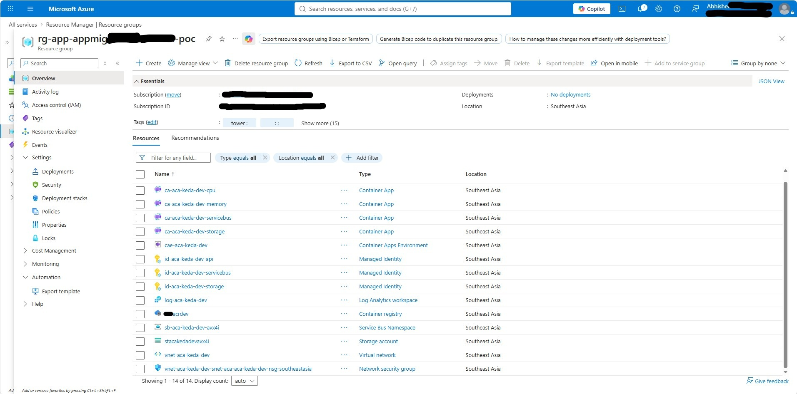

# ACA KEDA based scaling reference project

This project follows the Sample Terraform convention of separating environment values under `env/` from implementation under `main/`. It provides four Azure Container Apps scaling demonstrations:

* Azure Service Bus queue backlog (`azure-servicebus`)
* Azure Storage Queue backlog (`azure-queue`)
* CPU utilization (`cpu`)
* Memory utilization (`memory`)

The sample provisions an ACA workload-profile environment, VNet/subnet, Log Analytics, Service Bus, Storage Queue, managed identities, RBAC and four sample container apps. KEDA is managed by Azure Container Apps; the project only declares ACA scale rules.

## Prerequisites

* Azure Resource group should be already created (*sample Azure CLI command to create resource group:* `az group create --name <resource-group-name> --location "<azure-region>" --tags "Created By": <"Name of the Creator"> "Created On": <"dd-MMM-yyyy">`)
* Azure Container Registry (ACR) should be created (*sample Azure CLI command to create ACR:* `az acr create --resource-group <resource-group-name> --name <ACR-name> --sku Standard --role-assignment-mode rbac --dnl-scope TenantReuse`)
* You should have at least contributor and user access administrator role on your resource group scope.
* Docker desktop is installed and running for image build

## Structure

```text
env/dev.tfvars
main/
  main.aca.tf
  main.identity.tf
  main.messaging.tf
  main.monitoring.tf
  main.networking.tf
  outputs.tf
  providers.tf
  variables.aca.tf
  variables.tf
  modules/container-app/
sample-apps/
scripts/
```

## Deploy

1. Login to ACR (*command:* `az acr login --name <ACR\_SERVER> `)
2. Build and push the three sample images in `sample-apps/` to the ACR. (*command:* `.\\build-and-push-images.ps1 -Registry <ACR\_SERVER>`)
3. Update image values and subscription ID in `env/dev.tfvars`.
4. Run:

```bash
cd main
terraform init
terraform fmt -recursive
terraform validate
terraform plan -var-file="../env/dev.tfvars" -out="dev.tfplan"
terraform apply "dev.tfplan"
```



## Test

```bash
terraform output -json container\_app\_fqdns
python ../scripts/send-servicebus-messages.py <namespace> orders 100
python ../scripts/send-storagequeue-messages.py <account> work-items 100
curl "https://<cpu-fqdn>/cpu?seconds=30"
curl "https://<memory-fqdn>/memory?mb=200\&seconds=30"
```

## Production notes

Treat the supplied thresholds as UAT defaults. Validate queue processing rate, CPU/memory P95, application latency, dependency limits and replica behavior before production. Use immutable image tags, private networking, diagnostic settings, organizational tags and policy-compliant RBAC in production.

